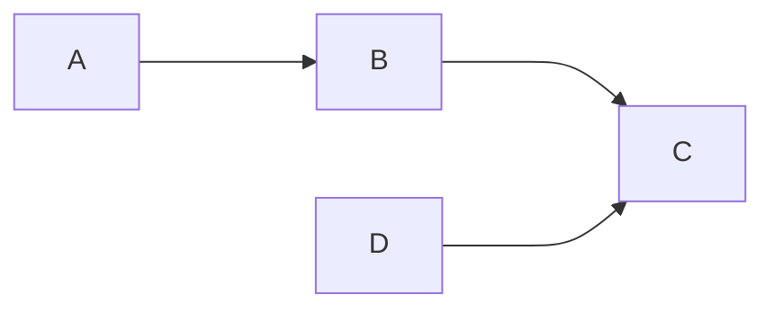

# markdown

```python
print("Hello World!")
```

```javascript
console.log("Hello World!")
```



Tables |      Are       | Cool
:-----|:--------------:|-----:
col 1 is|  left-aligned  | $1600  
col 2 is|    centered    | $12  
col 3 is| right-aligned  | $1